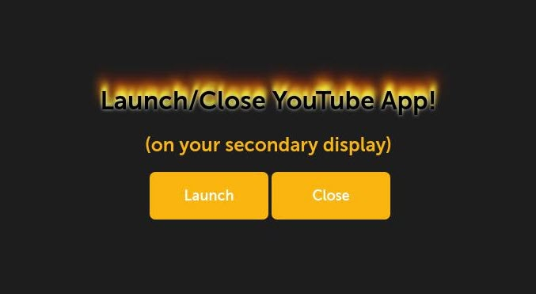

# Sample Web App for a Secondary Display

This sample app launches/closes a built-in YouTube app on your webOS OSE target device. You can learn how to launch an app on a secondary display using LS2 API.

> This app calls [LS2 APIs](https://www.webosose.org/docs/guides/development/web-apps/using-ls2-api-in-web-apps/) using [WebOSServiceBridge](https://www.webosose.org/docs/reference/webosservicebridge-api/webosservicebridge-api-reference/).

## Test Branch

## Prerequisites

- webOS OSE target device (RPi 4)
- Two 1920 x 1080 resolution displays
- Host machine with [webOS OSE CLI](https://www.webosose.org/docs/tools/sdk/cli/cli-user-guide/#installing-cli)

## How to Use

1. Clone this repository and move into the directory.

    ```
    git clone https://github.com/Heeam-Shin/web-app-controller-sample.git
    cd web-app-controller-sample
    ```

2. Package the app. If the packaging succeed, `.ipk` is created in your current directory.

    ```
    ares-package .
    ```

3. Install the `.ipk` file to your target device.

    ```
    ares-install -d [your target device name] ./com.webapp.sample_0.0.1_all.ipk
    ```

4. Go to your webOS OSE target device and launch the `Secondary display sample` app.

    